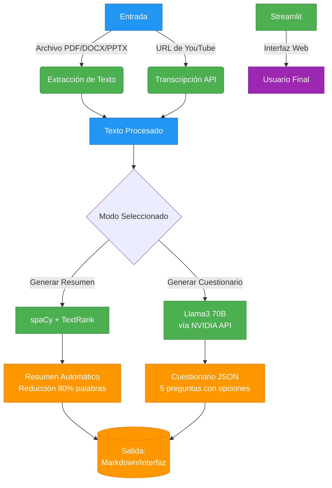
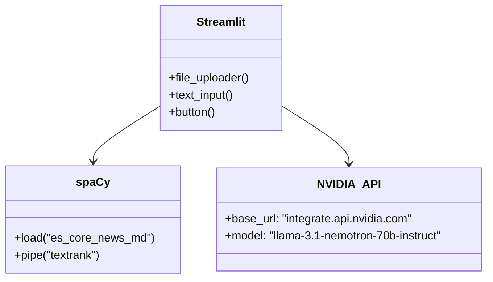

# Generador de Resúmenes y Cuestionarios Automatizados

## Descripción
Aplicación web que procesa archivos (PDF, DOCX, PPTX) o transcripciones de YouTube para generar:
- 📌 **Resúmenes automáticos** usando NLP (spaCy + TextRank)
- ❓ **Cuestionarios interactivos** con IA (Llama 3 70B via NVIDIA API)

**¿Por qué este proyecto?**  
Este generador automatiza la creación de resúmenes y cuestionarios a partir de materiales de estudio, ayudando a estudiantes y profesores a reducir el tiempo de estudio y proporcionar evaluaciones rápidas basadas en contenidos ya existentes. Es ideal para situaciones en las que se requiere procesar grandes cantidades de texto o contenido audiovisual de manera eficiente.

**¿A quién va dirigido?**  
El sistema está diseñado para ser utilizado por:
- **Estudiantes** que buscan repasar contenidos rápidamente mediante resúmenes y cuestionarios generados automáticamente.
- **Profesores** que desean generar evaluaciones personalizadas o resúmenes de sus clases grabadas o materiales didácticos.

---

## Capturas del Sistema

### 1. Análisis de Similitud (Histograma)


*Umbral óptimo: 0.85 (configurable en el código)*

*El histograma muestra cómo se realiza el análisis de similitud para determinar la relación entre las partes del texto. Un umbral de similitud más alto puede mejorar la precisión de los resúmenes.*

---

## 1.5. **Librerías Utilizadas**

- **Streamlit**: Para crear la interfaz gráfica de la aplicación.
- **PyPDF2**: Para extraer texto de archivos PDF.
- **python-docx**: Para extraer texto de archivos DOCX.
- **python-pptx**: Para extraer texto de archivos PPTX.
- **youtube_transcript_api**: Para obtener la transcripción de videos de YouTube.
- **spaCy**: Para procesar el texto y generar resúmenes.
- **NetworkX**: Para crear grafos y analizar la similitud entre oraciones.
- **OpenAI**: Para generar cuestionarios utilizando un modelo de lenguaje avanzado.
---

#### 1.5.1. **Detalles Matemáticos**

- **Grafo de Similitud**: Se crea un grafo donde cada nodo representa una oración. Las aristas entre nodos se crean si la similitud entre dos oraciones es mayor que un umbral (0.90 en este caso).
- **Similitud**: La similitud entre oraciones se calcula utilizando el modelo de spaCy, que utiliza embeddings (vectores numéricos) para representar el significado de las oraciones.

---

---
### 2. Interfaz Principal


*Selección entre archivos locales o URL de YouTube*

*La interfaz es fácil de usar y permite a los usuarios cargar archivos locales o pegar enlaces de YouTube directamente para comenzar a generar resúmenes y cuestionarios.*

---

### 3. Ejemplo de Resumen


*Reducción de 728 palabras → 120 palabras (83% más conciso)*

*El resumen es generado usando técnicas de NLP como TextRank, permitiendo una reducción considerable en la longitud del texto sin perder la esencia del contenido.*

---

### 4. Cuestionario Generado


*Las 5 preguntas con opciones múltiples y explicaciones se pueden modificar en esta sección de codigo, donde se debe considerar que a mayor cantidad de preguntas mayor es el coste en tokens de la consulta y por ende la cantidad de solicitudes a la api se reduce, por eso para este caso se usaron 5*


*El cuestionario generado es interactivo y permite a los usuarios evaluar su comprensión del material. Además, ofrece explicaciones detalladas para cada respuesta.*

---

## Tecnologías Utilizadas

### Descripción de Tecnologías:
- **spaCy**: Utilizado para el procesamiento de lenguaje natural (NLP). Su capacidad para trabajar con grandes volúmenes de texto permite una eficiente generación de resúmenes.
- **TextRank**: Algoritmo basado en grafos para extraer las frases más relevantes del texto, utilizado para la creación de resúmenes.
- **Llama 3 70B**: Modelo de lenguaje de última generación de NVIDIA utilizado para generar preguntas interactivas y con sentido, alimentado por la API de NVIDIA.
- **NVIDIA API**: Plataforma utilizada para acceder al modelo Llama 3 y generar preguntas personalizadas.





---

## Cómo Usar

1. **Sube un archivo** (PDF/DOCX/PPTX) o **pega URL de YouTube**.
2. **Elige el modo**:
   - ✂️ **Resumen**: Genera un resumen basado en análisis de similitud de texto.
   - 📝 **Cuestionario**: Genera un cuestionario interactivo basado en el contenido analizado.
3. **Explora los resultados**:
   - **Resumen**: Puedes exportarlo a **Markdown** o **PDF** para compartir o estudiar.
   - **Cuestionario**: Te permite responder preguntas interactivas y verificar tu comprensión.

### ¿Cómo se procesan los archivos?
- **Archivos PDF/DOCX/PPTX**: El texto se extrae usando bibliotecas específicas como `PyPDF2` para PDFs y `python-docx` para documentos de Word. Luego, se procesa para generar el resumen o cuestionario.
- **YouTube**: La API de transcripción extrae el audio del video y se convierte en texto. Luego, el texto se utiliza para generar el resumen o cuestionario.

---

## Recursos

### Modelos
| Nombre         | Uso                           | Licencia              |
|----------------|-------------------------------|-----------------------|
| `es_core_news_md` | Procesamiento de texto en español | MIT                   |
| `Llama 3 70B`   | Generación de preguntas        | Propietaria (NVIDIA)   |

### Datasets
- Transcripciones de YouTube (a través de API pública).
- Archivos subidos por usuarios.

### Requisitos:
- **API key de NVIDIA para Llama 3**: Necesaria para acceder a las capacidades del modelo.
- **Conexión a internet**: Requerida para obtener las transcripciones de YouTube y hacer uso de la API de NVIDIA.

---

## Notas

**Se requiere descargar la extension Markdown Preview Mermaid Support**
-**esto para que se visualizen de buena manera los diagramas en formato mermaid**

⚠️ **Limitaciones**:
- **Precisión del resumen**: Aunque el sistema está diseñado para crear resúmenes precisos, la calidad depende del contenido y formato del texto. Algunos detalles pueden perderse en la reducción.
- **Restricciones de YouTube**: El sistema puede tener dificultades para transcribir videos con restricciones de acceso, como los videos privados o protegidos por derechos de autor.
  
🛠️ **Código disponible en**: [GitHub/repo](https://github.com/simsimi2143/Sintetizador/tree/main)

---

# Guía de Instalación para el Generador de Resúmenes y Cuestionarios

```markdown


## Requisitos Previos

- Python 3.10 o inferior (recomendado 3.9.13)
- pip (gestor de paquetes de Python)
- Git (opcional, solo si clonas el repositorio)

## Instalación paso a paso

### 1. Clonar el repositorio (opcional)

```bash
git clone https://github.com/simsimi2143/Sintetizador.git
cd tu-repositorio
```

### 2. Crear un entorno virtual (recomendado)

```bash
python -m venv venv
```

**Activar el entorno virtual:**

- **Windows:**
  ```bash
  venv\Scripts\activate
  ```

- **Linux/MacOS:**
  ```bash
  source venv/bin/activate
  ```

### 3. Instalar dependencias

```bash
pip install -r requirements.txt
```

### 4. Descargar el modelo de lenguaje para spaCy

```bash
python -m spacy download es_core_news_md
```

### 5. Configurar la API de NVIDIA (opcional)

Si deseas usar la funcionalidad de generación de cuestionarios:

1. Obtén una API key de NVIDIA en [developer.nvidia.com](https://developer.nvidia.com/)
2. Edita el archivo principal (`app.py`) y reemplaza `"your_api_key"` con tu clave real

### 6. Ejecutar la aplicación

```bash
streamlit run app.py
```

## Solución de Problemas Comunes

### Error con spaCy en Python 3.11+

Si recibes errores relacionados con spaCy, verifica que estás usando Python 3.10 o inferior:

```bash
python --version
```

Si necesitas cambiar de versión, puedes usar `pyenv`:

```bash
pyenv install 3.9.13
pyenv global 3.9.13
```

### Problemas con las dependencias

Si hay conflictos entre paquetes:

1. Elimina el entorno virtual y créalo nuevamente
2. Instala las dependencias exactas especificadas:

```bash
pip install --force-reinstall -r requirements.txt
```

### Error al procesar archivos

- Para archivos PDF: Asegúrate de que no estén protegidos con contraseña
- Para archivos DOCX/PPTX: Verifica que no estén corruptos

## Estructura del Proyecto

```
tu-proyecto/
├── app.py                # Archivo principal de la aplicación
├── requirements.txt      # Lista de dependencias
├── README.md             # Documentación del proyecto
└── venv/                 # Entorno virtual (se crea al instalarlo)
```

## Notas Importantes

- Esta aplicación fue probada con Python 3.9.13
- El modelo de spaCy para español ocupa aproximadamente 40MB de espacio
- Para videos de YouTube, necesitarás conexión a internet para obtener las transcripciones
- La generación de cuestionarios requiere una API key válida de NVIDIA

## Licencia

Incluye aquí información sobre la licencia de tu proyecto si es necesario.
```

Puedes guardar este contenido en un archivo `INSTALL.md` o `GUIA_INSTALACION.md` en tu proyecto. Asegúrate de:

1. Reemplazar las rutas y nombres de repositorio con los tuyos
2. Actualizar la sección de licencia según corresponda
3. Agregar cualquier información adicional específica de tu proyecto

La guía incluye todos los pasos necesarios para instalar las dependencias específicas que mencionas, con especial atención a la versión de Python y los posibles problemas con spaCy.

